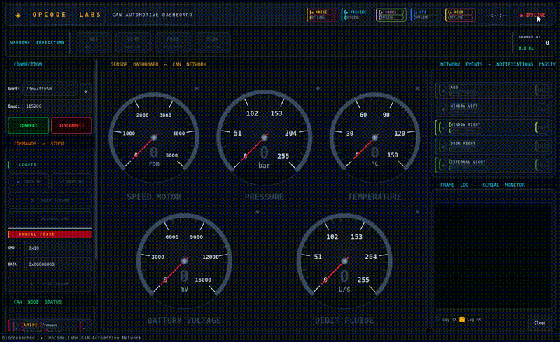
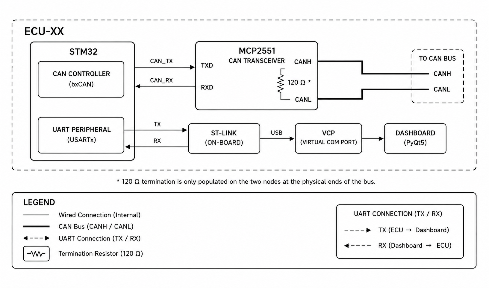
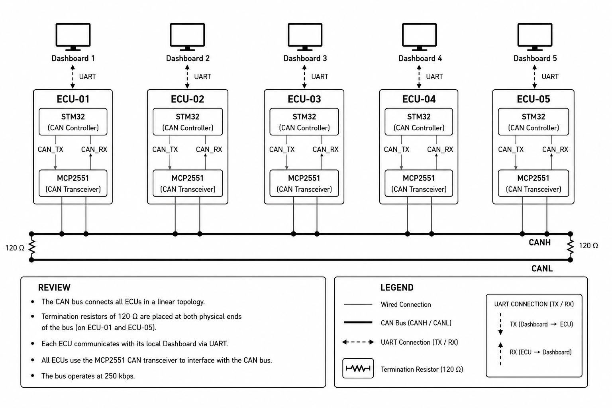
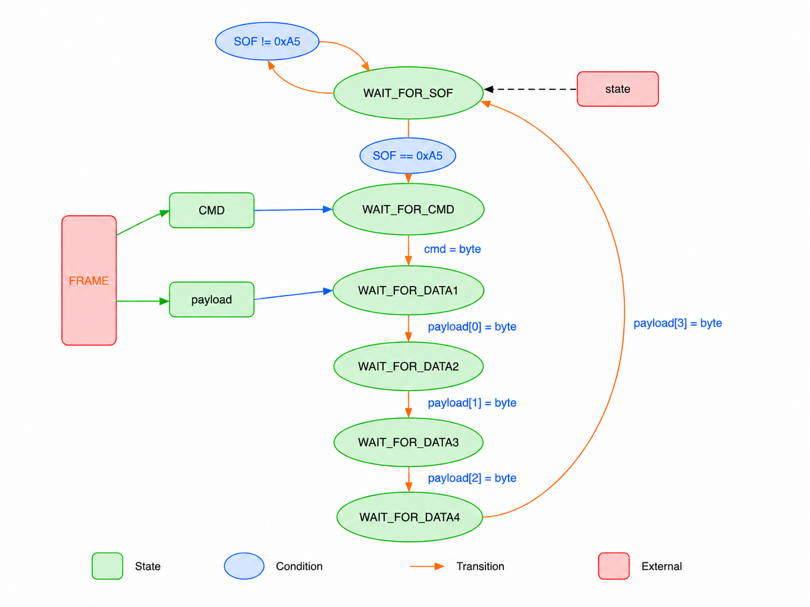
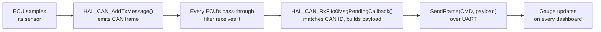
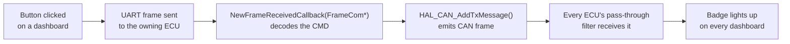
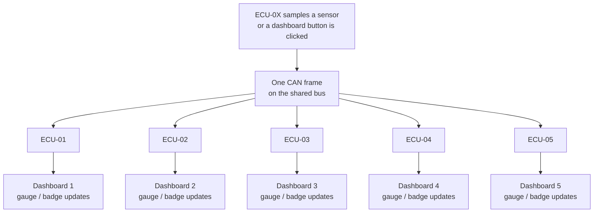

# STM32 CAN Automotive Dashboard

**▶ [Live Demo](https://saravanakumart362-create.github.io/stm32-can-automotive-dashboard/)** — the dashboard, the virtual test bench and the 3D car running in the browser on a *simulated* CAN bus. The real system runs on 5 STM32 boards: see the [hardware video](docs/assets/demo/dashboard_demo.md) and the [Saleae captures](docs/assets/demo/saleae_bitlevel_decode.md).

A distributed automotive telemetry and control system built on five independent STM32 nodes communicating over a shared CAN bus, each paired with its own real-time PyQt5 supervision dashboard.

Every node on the network sees the full picture: each one listens to all CAN traffic and mirrors it live on its own dashboard, turning five small embedded boards into a single coherent automotive network — sensors, actuators, and warnings included.

This repository contains my own node implementation (**ECU-01 — Pressure / ABS**) plus the shared PC dashboard, developed as part of a 5-node team project during my embedded systems internship at **OpCode Labs**.

---

## Dashboard Features

Each of the five dashboard instances is identical and shows:

- **Five classic-car-style gauges** — one per periodic sensor (Pressure, Speed Motor, Temperature, Fluid Flow, Battery Voltage), needle-based, updating live as CAN frames arrive
- **Five notification badges** — one per manual trigger (ABS, Window Left, Window Right, Door Right, External Light), lighting up briefly whenever the corresponding CAN event is seen on the bus, regardless of which node sent it
- **Threshold warnings** — automatic alerts when a reading crosses a defined limit (e.g. overheat, high pressure, low fluid flow), independent of the raw gauge display
- **CAN node status** — per-node badges showing which of the five ECUs have been heard from recently, so a node that goes offline is visually obvious
- **Frame log** — a live scrolling log of TX/RX UART frames, with timestamps, useful for debugging without a separate CAN analyzer
- **Manual frame sender** — a raw CMD/DATA input for sending arbitrary UART frames to the connected ECU, used during development and testing

---

## Demo



*Full video : [dashboard_demo.mp4](docs/assets/demo/dashboard_demo.mp4)*


### Dashboard Features

Each of the five dashboards is a PyQt5 application connected to its own ECU over UART. It combines several distinct visual elements:

- **Classic-car style gauges** — five analog-style dials (Pressure, Speed Motor, Temperature, Fluid Flow, Battery Voltage), one per periodic sensor signal, updating live as CAN frames arrive
- **Notification badges** — five indicators (ABS, Window Left, Window Right, Door Right, External Light) that light up briefly whenever the corresponding manual-trigger CAN frame is received, regardless of which node sent it
- **Threshold warnings** — dedicated alerts that activate automatically when a sensor value crosses a defined limit: overheat (Temperature), high pressure (Pressure), low flow (Fluid Flow)
- **CAN node status** — a live view of which nodes are currently seen on the bus, along with a running frame counter and reception rate, so a dropped connection or a silent node is immediately visible
- **Manual trigger button** — the single command button owned by that ECU (see Signal Map), used to simulate its physical event without needing the real button hardware
- **TX/RX frame log** — a scrolling log of raw UART frames sent and received, useful for debugging the protocol at the byte level

---

## Architecture

### ▸ ECU Internal Detail



Each ECU has two independent signal paths out of the STM32:
- **CAN path:** the STM32's built-in CAN controller talks to an external MCP2551 transceiver, which drives the differential CANH/CANL lines onto the bus. On the two nodes sitting at the physical ends of the bus, a 120Ω resistor bridges CANH and CANL inside the transceiver stage.
- **UART path:** the STM32's UART peripheral is wired to the on-board ST-Link, which exposes a Virtual COM Port (VCP) over USB — this is the serial port the dashboard connects to. The exact port shown (e.g. `COM1`, `COM7` on Windows, `/dev/ttyACM0` on Linux) is just an example — it depends entirely on the host machine and which USB port is used, and can differ from one connection to the next.

### ▸ Network Overview



All five ECUs share the identical internal signal path described above and sit on the same physical CAN bus.

Each ECU:
- Broadcasts its own **periodic sensor reading** on the CAN bus
- Owns **one manual trigger** — a button in its own dashboard that emits an asynchronous CAN event, standing in for a physical button press
- Runs a **pass-through CAN filter**: it receives every frame on the bus, not just its own, and mirrors all of it to its dashboard over UART
- Can be commanded from its dashboard (LED control, sensor read-back, or forwarding a command onto the CAN bus)

---

## Communication Protocol

### CAN Bus
- Bitrate: **250 kbps**
  Computed from `Prescaler = 4`, `BS1 = 6TQ`, `BS2 = 1TQ`, on an APB1 clock of 8 MHz (HSE bypass, no PLL):
  `t_quantum = 4 / 8,000,000 = 0.5 µs` → `bit_time = 0.5 × (1+6+1) = 4 µs` → `250 kbps`
  Measured and confirmed with a Saleae logic analyzer, decoding the bus down to individual bit timing.
- Mode: **Normal** — required so nodes can acknowledge each other's frames; a bus with every node in Loopback or Silent mode would never see a valid ACK and would stall on retransmission.
- Filter: pass-through on every node (`Mask = 0x0000` — accepts every ID)

### UART (ECU ↔ Dashboard)
- 115200 baud, 8N1, no hardware flow control
- Fixed 6-byte frame: `SOF (1B) | CMD (1B) | PAYLOAD (4B)`
- `SOF = 0xA5`
- No checksum — frame sync relies solely on the SOF byte; a corrupted byte mid-frame is not detected, only a lost SOF triggers resynchronization

### Signal Map

| ECU    | Periodic sensor | CAN ID  | Manual trigger  | CAN ID  |
|--------|------------------|---------|------------------|---------|
| ECU-01 | Pressure         | `0x55C` | ABS              | `0x679` |
| ECU-02 | Speed Motor      | `0x406` | Window Left      | `0x401` |
| ECU-03 | Temperature      | `0x456` | Window Right     | `0x402` |
| ECU-04 | Fluid Flow       | `0x390` | Door Right       | `0x790` |
| ECU-05 | Battery Voltage  | `0x222` | External Light   | `0x221` |

Every ECU receives every ID above — the five gauges and five notification badges on each dashboard update regardless of which node originated the frame. A manual trigger click even lights up its own badge on the sender's dashboard, since the frame travels out onto the bus and back in through the same pass-through filter.

---

## Firmware Design

### Two independent reception paths

The firmware handles two separate interrupt-driven inputs.

**1. CAN reception**

```c
void HAL_CAN_RxFifo0MsgPendingCallback(CAN_HandleTypeDef *hcan)
{
    HAL_CAN_GetRxMessage(hcan, CAN_RX_FIFO0, &RxHeader, RxData);

    switch (RxHeader.StdId)
    {
        case CANID_PRESSURE:
        {
            uint8_t payload[4] = {RxData[0], RxData[1], RxData[2], RxData[3]};
            SendFrame(CMD_SENSOR_VALUE, payload);
            break;
        }
        /* ... one case per CAN ID in the Signal Map ... */
        default:
            break;
    }
}
```

This callback fires in interrupt context the instant a CAN frame lands in FIFO0. Unlike a flag-and-poll design, it does the full job inline: read the frame out of the hardware FIFO, match `RxHeader.StdId` directly against the Signal Map, build the corresponding 4-byte UART payload, and call `SendFrame()` — all within the ISR.

**2. UART reception — byte-by-byte state machine**

Every frame exchanged between an ECU and its dashboard is exactly 6 bytes long: one start-of-frame byte (`SOF = 0xA5`), followed by one command byte (`CMD`), followed by a 4-byte payload. The SOF is what lets the receiver find the beginning of a frame in a continuous stream of bytes — without it, there would be no way to tell where one frame ends and the next begins.



**State description**

| State | Role |
|-------|------|
| `WAIT_FOR_SOF`   | Waits for the start-of-frame byte (`0xA5`); any other byte is dropped and the state stays put |
| `WAIT_FOR_CMD`   | Stores the received byte as `cmd` |
| `WAIT_FOR_DATA1` | Stores the received byte as `payload[0]` |
| `WAIT_FOR_DATA2` | Stores the received byte as `payload[1]` |
| `WAIT_FOR_DATA3` | Stores the received byte as `payload[2]` |
| `WAIT_FOR_DATA4` | Stores the received byte as `payload[3]`, then dispatches the completed frame and returns to `WAIT_FOR_SOF` |

A byte that doesn't match `0xA5` while idle is simply dropped, letting the parser resynchronize if the connection opens mid-frame. Bytes are handled one at a time, in interrupt context, via `HAL_UART_RxCpltCallback()`. Once the state machine reaches `WAIT_FOR_DATA4` and consumes the last payload byte, the fully-assembled frame is handed off to `NewFrameReceivedCallback(FrameCom *rxFrame)`, which decodes the CMD byte and — for the manual-trigger path — calls `HAL_CAN_AddTxMessage()` to put the corresponding frame onto the CAN bus. There is no timeout on an incomplete frame and no checksum — see [UART](#uart-ecu--dashboard) above for details.

### Data Flow

**Periodic sensor path**



**Manual trigger path**



The manual trigger path re-uses the same CAN bus as the periodic path: once emitted, the frame reaches every node — including the one that sent it.

### Full Network View



Because every node runs the same pass-through filter, there is no single "gateway" or master on this network — each ECU is both a producer and a relay for the entire bus.

---

## Tools Used

**Firmware development**
- STM32CubeMX — peripheral and clock configuration
- STM32CubeIDE — code editing, build, flash

**Dashboard development**
- Visual Studio Code
- Python 3, PyQt5, pyserial

**Validation / debugging**
- PEAK PCAN-USB + PCAN-View — live CAN bus traffic monitoring, used to independently confirm frame IDs, payloads and cycle times during development
- Saleae Logic Analyzer — bit-level decoding of the CAN signal (identifier field, control field, data field, CRC, ACK), used to verify the 250 kbps bitrate against the theoretical calculation

---

## Repository Structure

```
stm32-can-automotive-dashboard/
├── docs/
│   ├── index.html                            # live demo page (GitHub Pages)
│   ├── web/                                  # demo: simulated bus, dashboard, bench, 3D car (JS)
│   ├── cahier_des_charges.xlsx              # project requirements (generic)
│   ├── SRS_STM32_CAN_UART_Dashboard.xlsx     # as-built SRS, requirement-to-code traceability
│   ├── debugging_notes.md                    # resolved technical issues
│   └── assets/
│       ├── ecu_detail.png
│       ├── network_overview.png
│       ├── state_machine.png
│       ├── screenshots/                      # dashboard screenshots / demo GIF
│       └── demo/
│           ├── dashboard_demo.md             # full dashboard demo video
│           ├── dashboard_demo.mp4
│           ├── pcan_cross_validation.md      # cross-node validation with PCAN-View
│           ├── pcan_cross_validation.mp4
│           ├── pcan_frame_capture.md         # live CAN frame capture
│           ├── pcan_frame_capture.mp4
│           ├── saleae_bitlevel_decode.md     # bit-level CAN decode + raw capture
│           ├── can.sal
│           └── hardware_setup.md             # wiring schematic, transceiver, board, analyzers
├── firmware/
│   ├── Core/
│   │   ├── Inc/                  # headers
│   │   └── Src/                  # main.c and generated sources
│   ├── Drivers/
│   │   ├── CMSIS/                # ARM core support files
│   │   └── STM32F4xx_HAL_Driver/ # ST HAL library
│   └── *.ioc, *.ld               # CubeMX config, linker scripts
└── dashboard/
    ├── stm32_dashboard.py        # Stable launcher and public entry point
    ├── dashboard_window.py       # Main window and dashboard behavior
    ├── widgets.py                # Reusable gauges, badges, and indicators
    ├── protocol.py               # UART frame reader
    ├── config.py                 # CAN commands, thresholds, and theme
    ├── virtual_ecu.py            # Simulated 5-node CAN bus + ECU-01 UART link
    ├── virtual_bench.py          # Virtual test bench window (--sim)
    ├── virtual_car3d.py          # Virtual car in 3D window (--3d)
    └── __init__.py               # Dashboard package exports
```

---

## Getting Started

### Firmware
1. Open the `.ioc` file in STM32CubeMX to inspect the peripheral configuration (optional)
2. Open the project in STM32CubeIDE
3. Build and flash to the target board (Run / Debug)

### Dashboard
```bash
pip install PyQt5 pyserial
python dashboard/stm32_dashboard.py
```
Select the board's serial port in the Connection panel, then click **Connect**:
- **Windows:** the board typically enumerates as `COMx` (e.g. `COM7`) — check Device Manager under "Ports (COM & LPT)" if unsure.
- **Linux:** the board typically enumerates as `/dev/ttyACMx` (e.g. `/dev/ttyACM0`).
- **macOS:** the board typically enumerates as `/dev/tty.usbmodemXXXX`.

The exact port name depends on the host machine and USB port used, so check your OS's device list if the expected port doesn't appear.
